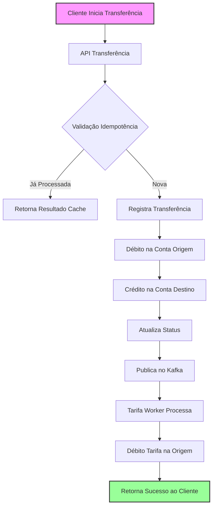

# Ailos Banking System - Sistema Bancário Completo

## 🏦 Visão Geral do Sistema

Sistema bancário completo composto por **3 microsserviços** que trabalham em conjunto para fornecer operações financeiras seguras, escaláveis e com arquitetura moderna. Desenvolvido em .NET 8 com padrões de mercado e boas práticas de desenvolvimento.

## 📦 Componentes do Sistema

### 🔵 **1. Ailos.ContaCorrente.Api**
**API de Gerenciamento de Contas Correntes**  
- Cadastro e autenticação de usuários
- Movimentações (crédito/débito)
- Consulta de saldo e histórico
- Inativação de contas
- **Porta**: `5081`

### 🔴 **2. Ailos.Transferencia.Api**  
**API de Transferências entre Contas**  
- Transferências internas com segurança
- Processamento transacional distribuído
- Idempotência garantida
- Integração com sistema de tarifas
- **Porta**: `5082`

### 🟢 **3. Ailos.Tarifa.Worker** (Próximo)
**Worker de Processamento de Tarifas**  
- Consumidor Kafka de transferências
- Aplicação automática de tarifas
- Processamento assíncrono
- Comunicação com API de movimentação

## 🚀 Funcionalidades Principais

### 🔐 **Segurança Avançada**
- **JWT Authentication**: Tokens com expiração configurável
- **Senhas Criptografadas**: Hash BCrypt com salt único
- **CPF Validado**: Validação completa com dígitos verificadores
- **IDs Ofuscados**: Encrypted ID para proteção de identificadores
- **HTTPS**: Comunicação segura em produção

### 💳 **Operações Bancárias**
- **Cadastro de Conta**: CPF, nome e senha
- **Login Flexível**: Por CPF ou número da conta
- **Movimentações**: Crédito (C) e Débito (D)
- **Transferências**: Entre contas da mesma instituição
- **Consulta de Saldo**: Em tempo real
- **Inativação**: Com validação de senha

### ⚡ **Recursos Avançados**
- **Idempotência**: Garantia de processamento único
- **Transações Distribuídas**: Rollback automático em falhas
- **Processamento Assíncrono**: Kafka para tarifação
- **Validações de Domínio**: Regras de negócio robustas
- **Health Checks**: Monitoramento completo

## 🏗️ Arquitetura do Sistema

```
┌─────────────────────────────────────────────────────────────┐
│                    Aplicações Client-Side                    │
│  (Web/Mobile Apps, Third-party Integrations)                │
└─────────────────────────────────────────────────────────────┘
                              │
                              ▼
┌─────────────────────────────────────────────────────────────┐
│                    API Gateway (Opcional)                    │
│  (Load Balancing, Rate Limiting, Authentication)            │
└─────────────────────────────────────────────────────────────┘
                              │
               ┌──────────────┼──────────────┐
               ▼              ▼              ▼
┌─────────────────┐  ┌─────────────────┐  ┌─────────────────┐
│ Conta Corrente  │  │  Transferência  │  │     Kafka       │
│     API         │  │      API        │  │    Cluster      │
│  (Porta 5081)   │  │   (Porta 5082)  │  │  (Porta 9092)   │
└─────────────────┘  └─────────────────┘  └─────────────────┘
       │                      │                      │
       ▼                      ▼                      ▼
┌─────────────────┐  ┌─────────────────┐  ┌─────────────────┐
│  SQLite DB      │  │  SQLite DB      │  │   Tarifa        │
│  (Contas)       │  │  (Transferências)│  │    Worker       │
│                 │  │                  │  │   (Próximo)     │
└─────────────────┘  └─────────────────┘  └─────────────────┘
```

## 📊 Fluxo de Transferência



## 📋 Endpoints das APIs

### 🔵 **Conta Corrente API** (`:5081`)
#### 🔓 Públicos
- `POST /api/contacorrente/cadastrar` - Cadastro de conta
- `POST /api/contacorrente/login` - Autenticação

#### 🔐 Protegidos
- `PUT /api/contacorrente/inativar` - Inativar conta
- `GET /api/contacorrente/saldo` - Consultar saldo
- `POST /api/movimentacao` - Realizar movimentação

### 🔴 **Transferência API** (`:5082`)
#### 🔐 Protegidos
- `POST /api/transferencia` - Realizar transferência
- `GET /api/transferencia/historico` - Histórico de transferências

## 🛠️ Stack Tecnológica

### **Backend (.NET 8)**
- **ASP.NET Core 8** - Framework principal
- **Entity Framework Core** - ORM (opcional para migrações)
- **Dapper** - Micro ORM para performance
- **SQLite** - Banco de dados leve e embutido
- **JWT Bearer** - Autenticação por tokens
- **BCrypt.Net** - Criptografia de senhas

### **Comunicação & Mensageria**
- **Kafka** - Sistema de mensageria distribuído
- **KafkaFlow** - Biblioteca .NET para Kafka
- **HTTP Client** - Comunicação síncrona entre APIs
- **RESTful APIs** - Design de APIs REST

### **Infraestrutura & DevOps**
- **Docker** - Containerização
- **Docker Compose** - Orquestração local
- **SQLite** - Bancos de dados em arquivos
- **Health Checks** - Monitoramento de saúde

### **Segurança & Validação**
- **Encrypted ID** - Ofuscação de identificadores
- **FluentValidation** - Validação de dados
- **ProblemDetails** - Padronização de erros
- **API Key Authentication** - Autenticação entre serviços

### **Documentação & Qualidade**
- **Swagger/OpenAPI** - Documentação interativa
- **xUnit** - Testes unitários
- **FluentAssertions** - Asserts expressivos
- **Serilog** - Logging estruturado

## 🚀 Início Rápido

### Pré-requisitos
```bash
# 1. .NET 8 SDK
dotnet --version  # Deve mostrar 8.x.x

# 2. Docker & Docker Compose
docker --version
docker-compose --version

# 3. Git
git --version
```

### Clone e Configuração
```bash
# 1. Clone o repositório
git clone https://github.com/seu-usuario/ailos-banking-system.git
cd ailos-banking-system

# 2. Configure as variáveis de ambiente
cp .env.example .env
# Edite o .env com suas chaves secretas

# 3. Restaure dependências
dotnet restore

# 4. Execute com Docker Compose
docker-compose up -d --build
```

### Acesse os Serviços
```bash
# API Conta Corrente - Swagger
http://localhost:5081/swagger

# API Transferência - Swagger  
http://localhost:5082/swagger

# Kafka UI - Monitoramento
http://localhost:8080

# Health Checks
http://localhost:5081/health
http://localhost:5082/health
```

## 🐳 Docker Compose

```yaml
version: '3.8'

services:
  # Banco de Dados SQLite
  sqlite-db:
    image: nouchka/sqlite3:latest
    volumes:
      - ./data:/root/db
    command: sleep infinity

  # Kafka Cluster
  zookeeper:
    image: confluentinc/cp-zookeeper:latest
  
  kafka:
    image: confluentinc/cp-kafka:latest
    ports: ["9092:9092"]
    depends_on: [zookeeper]

  # APIs
  conta-corrente-api:
    build: ./src/Ailos.ContaCorrente.Api
    ports: ["5081:80"]
    depends_on: [sqlite-db, kafka]
    environment:
      - ENCRYPTED_ID_SECRET=${ENCRYPTED_ID_SECRET}
      - JwtSettings__Secret=${JWT_SECRET}
      - Kafka__BootstrapServers=kafka:9092

  transferencia-api:
    build: ./src/Ailos.Transferencia.Api  
    ports: ["5082:80"]
    depends_on: [conta-corrente-api, kafka]
    environment:
      - ENCRYPTED_ID_SECRET=${ENCRYPTED_ID_SECRET}
      - JwtSettings__Secret=${JWT_SECRET}
      - ContaCorrenteApi__BaseUrl=http://conta-corrente-api:80
      - Kafka__BootstrapServers=kafka:9092
```

## 📊 Banco de Dados

### **Conta Corrente Database**
```sql
-- Contas Correntes
CREATE TABLE contacorrente (
    idcontacorrente INTEGER PRIMARY KEY AUTOINCREMENT,
    cpf TEXT NOT NULL UNIQUE,
    numero INTEGER NOT NULL UNIQUE,
    nome TEXT NOT NULL,
    ativo INTEGER NOT NULL DEFAULT 1,
    senha_hash TEXT NOT NULL,
    // salt TEXT NOT NULL,
    data_criacao TEXT NOT NULL DEFAULT (datetime('now')),
    CHECK (ativo IN (0, 1))
);

-- Movimentações
CREATE TABLE movimento (
    idmovimento INTEGER PRIMARY KEY AUTOINCREMENT,
    idcontacorrente INTEGER NOT NULL,
    datamovimento TEXT NOT NULL DEFAULT (datetime('now')),
    tipomovimento TEXT NOT NULL,
    valor REAL NOT NULL,
    descricao TEXT,
    CHECK (tipomovimento IN ('C', 'D')),
    FOREIGN KEY(idcontacorrente) REFERENCES contacorrente(idcontacorrente)
);
```

### **Transferência Database**
```sql
-- Transferências
CREATE TABLE transferencia (
    idtransferencia INTEGER PRIMARY KEY AUTOINCREMENT,
    idcontacorrente_origem INTEGER NOT NULL,
    idcontacorrente_destino INTEGER NOT NULL,
    datamovimento TEXT NOT NULL DEFAULT (datetime('now')),
    valor REAL NOT NULL,
    tarifa_aplicada REAL DEFAULT 0.00,
    status TEXT NOT NULL DEFAULT 'PROCESSANDO',
    mensagem_erro TEXT,
    identificacao_requisicao TEXT UNIQUE,
    CHECK (status IN ('PROCESSANDO', 'CONCLUIDA', 'FALHA', 'ESTORNADA'))
);

-- Idempotência
CREATE TABLE idempotencia (
    chave_idempotencia TEXT PRIMARY KEY,
    requisicao TEXT,
    resultado TEXT,
    data_criacao TEXT NOT NULL DEFAULT (datetime('now'))
);
```

## 🔐 Sistema de Segurança

### **Encrypted ID System**
```csharp
// IDs ofuscados nas APIs
public sealed record TransferenciaResponse
{
    [JsonConverter(typeof(EncryptedIdJsonConverter))]
    public required EncryptedId TransferenciaId { get; init; }
    
    [JsonConverter(typeof(EncryptedIdJsonConverter))]  
    public required EncryptedId ContaOrigemId { get; init; }
    
    [JsonConverter(typeof(EncryptedIdJsonConverter))]
    public required EncryptedId ContaDestinoId { get; init; }
}
```

### **Autenticação JWT**
```yaml
JwtSettings:
  Secret: "super-secret-key-min-32-chars"
  Issuer: "AilosBankingSystem"
  Audience: "AilosClients"
  ExpirationMinutes: 60
```

## ⚡ Processo de Transferência

### **1. Validação Inicial**
```csharp
// Verificação de idempotência
if (await _idempotenciaService.RequisicaoJaProcessadaAsync(request.IdentificacaoRequisicao))
{
    return await ProcessarRequisicaoIdempotente(request.IdentificacaoRequisicao);
}
```

### **2. Processamento Transacional**
```csharp
try
{
    // Débito na origem
    await _contaCorrenteClient.RealizarMovimentacaoAsync(
        contaOrigemId, "D", valor, "Transferência");
    
    // Crédito no destino  
    await _contaCorrenteClient.RealizarMovimentacaoAsync(
        contaDestinoId, "C", valor, "Transferência recebida");
    
    // Atualiza status
    transferencia.Concluir();
    
    // Publica no Kafka para tarifação
    await _kafkaProducerService.ProduzirMensagemAsync(
        "transferencias-realizadas", transferencia);
}
catch
{
    // Rollback automático
    await RealizarEstorno(contaOrigemId, valor);
    throw;
}
```

## 📝 Exemplos de Uso

### **1. Cadastro de Conta**
```bash
curl -X POST "http://localhost:5081/api/contacorrente/cadastrar" \
  -H "Content-Type: application/json" \
  -d '{
    "cpf": "12345678909",
    "nome": "Maria Silva",
    "senha": "Senha@123"
  }'
```

### **2. Login**
```bash
curl -X POST "http://localhost:5081/api/contacorrente/login" \
  -H "Content-Type: application/json" \
  -d '{
    "cpf": "12345678909",
    "senha": "Senha@123"
  }'
```

### **3. Transferência com Idempotência**
```bash
curl -X POST "http://localhost:5082/api/transferencia" \
  -H "Authorization: Bearer {TOKEN_JWT}" \
  -H "X-Idempotency-Key: transfer-123-abc" \
  -H "Content-Type: application/json" \
  -d '{
    "identificacaoRequisicao": "transfer-123-abc",
    "contaDestinoId": "eyJhbGciOiJIUzI1NiIs...",
    "valor": 150.75,
    "descricao": "Pagamento serviço"
  }'
```

### **4. Consulta Histórico**
```bash
curl -X GET "http://localhost:5082/api/transferencia/historico" \
  -H "Authorization: Bearer {TOKEN_JWT}" \
  -H "Content-Type: application/json"
```

## 🧪 Testando o Sistema

### **Testes Unitários**
```bash
# Executar todos os testes
dotnet test

# Testes com cobertura
dotnet test --collect:"XPlat Code Coverage"

# Testes específicos
dotnet test --filter "FullyQualifiedName~Transferencia"
```

### **Testes de Integração**
```bash
# Subir ambiente completo
docker-compose up -d

# Executar scripts de teste
./scripts/test-integration.sh

# Verificar logs
docker-compose logs -f transferencia-api
```

## 🔍 Monitoramento

### **Health Checks**
```bash
# Verificar saúde das APIs
curl http://localhost:5081/health
curl http://localhost:5082/health
```

### **Kafka UI**
Acesse `http://localhost:8080` para:
- Monitorar tópicos
- Ver mensagens em tempo real
- Gerenciar consumidores

### **Logs**
```bash
# Ver logs em tempo real
docker-compose logs -f

# Logs específicos
docker-compose logs transferencia-api
docker-compose logs conta-corrente-api
```

## 🚢 Deployment

### **Ambiente de Produção**
```bash
# Build das imagens
docker build -t ailos/conta-corrente:prod ./src/Ailos.ContaCorrente.Api
docker build -t ailos/transferencia:prod ./src/Ailos.Transferencia.Api

# Push para registry
docker push ailos/conta-corrente:prod
docker push ailos/transferencia:prod

# Kubernetes (exemplo)
kubectl apply -f k8s/production/
```

### **Variáveis de Ambiente de Produção**
```env
# Arquivo .env.production
ENCRYPTED_ID_SECRET=chave-segura-producao-32-caracteres
JwtSettings__Secret=jwt-secret-producao-minimo-32-chars
ASPNETCORE_ENVIRONMENT=Production
KAFKA_BOOTSTRAP_SERVERS=kafka-prod:9092
DATABASE_CONNECTION=Server=sql-server;Database=ailos;User=sa;Password=xxx
```

## 📈 Métricas e Observabilidade

### **Métricas Coletadas**
- Taxa de transferências por segundo
- Tempo médio de resposta
- Taxa de erros por endpoint
- Uso de banco de dados
- Status do Kafka

### **Alertas Configuráveis**
- Taxa de erro > 1%
- Latência > 500ms
- Saúde do banco de dados
- Consumidores Kafka offline

## 🔄 CI/CD Pipeline

```yaml
# Exemplo GitHub Actions
name: Ailos CI/CD

on: [push, pull_request]

jobs:
  test:
    runs-on: ubuntu-latest
    steps:
      - uses: actions/checkout@v2
      - name: Setup .NET
        uses: actions/setup-dotnet@v1
      - name: Run tests
        run: dotnet test
  
  build:
    needs: test
    runs-on: ubuntu-latest
    steps:
      - uses: actions/checkout@v2
      - name: Build Docker images
        run: docker-compose build
  
  deploy:
    needs: build
    runs-on: ubuntu-latest
    if: github.ref == 'refs/heads/main'
    steps:
      - name: Deploy to Production
        run: ./scripts/deploy-prod.sh
```

## 🤝 Contribuindo

1. **Fork o repositório**
2. **Crie uma branch de feature**
   ```bash
   git checkout -b feature/nova-funcionalidade
   ```
3. **Commit suas mudanças**
   ```bash
   git commit -m 'Adiciona nova funcionalidade'
   ```
4. **Push para a branch**
   ```bash
   git push origin feature/nova-funcionalidade
   ```
5. **Abra um Pull Request**

### **Padrões de Código**
- Use `PascalCase` para classes
- Use `camelCase` para variáveis
- Documente métodos públicos
- Mantenha cobertura de testes > 80%

## 📄 Licença

Este projeto está licenciado sob a **Licença MIT** - veja o arquivo [LICENSE](LICENSE) para detalhes.

## 🆘 Suporte

- **Documentação**: [docs.ailosbank.com](https://docs.ailosbank.com)
- **Issues**: [GitHub Issues](https://github.com/EnzoVieira3012/ailos-test/issues)
- **Email**: enzovieira.trabalho@outlook.com
- **Slack**: #ailos-developers

---

<div align="center">

## 🏦 **Ailos Banking System**
**Soluções bancárias modernas, seguras e escaláveis**

[](https://dotnet.microsoft.com/)
[](https://docker.com)
[](https://kafka.apache.org/)
[](LICENSE)

**Desenvolvido com excelência técnica para desafios reais do mercado financeiro**

</div>
